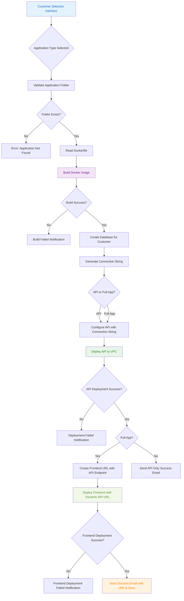
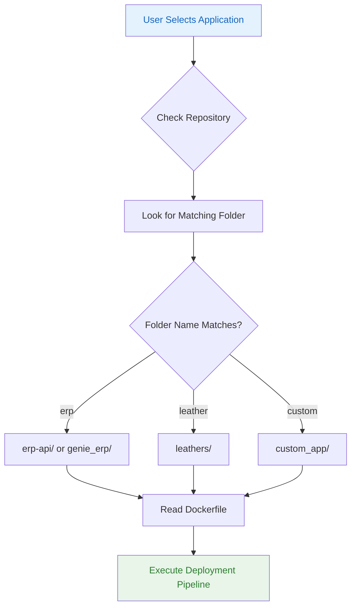

# SaaS Deployment Platform

A fully automated deployment platform that allows customers to deploy various applications (React, Angular, APIs, etc.) with a simple selection interface. The platform handles containerization, deployment to VPC, and customer notifications automatically.

## 🚀 Features

- **Multi-Application Support**: Deploy React, Angular, Node.js APIs, and other web applications
- **Automated Pipeline**: Complete CI/CD pipeline from application selection to deployment
- **VPC Deployment**: Secure deployment in configured Virtual Private Cloud
- **Email Notifications**: Automatic success notifications with deployment URLs and documentation
- **Docker Containerization**: Automatic Docker image building and deployment
- **Customer Management**: Track deployments by customer name and email

## 🏗️ Architecture Overview



## 📁 Repository Structure

```
saas-deployment-platform/
├── .github/
│   └── workflows/
│       └── deploy.yml 
|       └── cleanup.yml
|       └── main.yml 
|       └── send_email.yml   # Main deployment pipeline
├── Documentation/              # Platform documentation
├── erp_api/                   # ERP API application
│   ├── Dockerfile
│   ├── src/
├── erp_fullapp/                 # Genie ERP application
│   ├── Dockerfile
│   ├── src/
├── leathers_api/                  # Leather management app
│   ├── Dockerfile
│   ├── src/
├── leathers_fullapp
│   ├── Dockerfile
│   ├── dist/
├── Scripts/                   # Deployment scripts
│   ├── Modules
│       └── clone_mssql.sh 
|       └── clone_msysql.sh
|       └── create-subdomin.sh 
|       └── docker_run.sh
|       └── generate_env_file.sh
│   └── main.sh
├── .gitignore
├── LICENSE
└── README.md
```

## 🔧 How It Works

### Application Matching Logic



## 📦 Adding New Applications

### Step 1: Create Application Folder

Create a new folder in the repository root with your application name:

```bash
mkdir your-app-name
cd your-app-name
```


### ✅ Step 2: Add Your Application Files

Prepare your application files based on your tech stack. The goal is to **standardize all deployments** by placing your final application files into a folder called `src/`.

---

#### ⚛️ React and angular Applications

- ❌ DO NOT copy the full project.
- ✅ Only copy the **contents of the `build/` folder** (from `npm run build`).
- ✅ Create a folder named `src/` at the root and paste the build contents inside it.


```
example: 
your-app-name/
├── Dockerfile
├── src/
│ ├── index.html
│ ├── static/
│ └── ...
```
#### 🐘 PHP Applications

- ✅ Copy **all files and folders** of your PHP project (`index.php`, `config/`, `vendor/`, etc.).
- ✅ Create a `src/` folder and paste everything inside.
  
```
your-app-name/
├── Dockerfile
├── src/
│ ├── index.php
│ ├── config/
│ ├── vendor/
│ └── ...
```

---

#### 🟢 Node.js Applications

- ✅ Copy the `package.json`, `package-lock.json`, and your final app files (e.g., from `dist/`, `build/`, or `src/` depending on your setup).
- ✅ Place them all inside a `src/` folder.
```
your-app-name/
├── Dockerfile
├── src/
│ ├── server.js
│ ├── routes/
│ ├── controllers/
│ ├── package.json
│ └── ...
```
---
#### 🐍 Python Applications

- ✅ Copy your main application files (e.g., `app.py`, `main.py`, etc.), dependencies (`requirements.txt`), and support files.
- ✅ Place everything inside a `src/` folder.
```
your-app-name/
├── Dockerfile
├── src/
│ ├── app.py
│ ├── requirements.txt
│ └── ...
```
---

#### 🟣 .NET Applications (ASP.NET Core)

- ✅ After publishing your project using:

bash
dotnet publish -c Release -o ./publish
```
your-app-name/
├── Dockerfile
├── src/
│   ├── MyApp.dll
│   ├── web.config
│   ├── appsettings.json
│   └── ...
```
---
#### ✅ Important Notes:

Your Dockerfile must always be at the root level (your-app-name/), not inside src/.

Only copy build or deploy-ready files, not the entire source project.

This standard structure makes automation, Docker builds, and deployment cleaner and more predictable.
### Step 3: Create Dockerfile

Create an appropriate Dockerfile based on your application type:

#### React Application
```dockerfile
FROM nginx:alpine
COPY build/ /usr/share/nginx/html/
EXPOSE 80
CMD ["nginx", "-g", "daemon off;"]
```

#### Angular Application
```dockerfile
# Use NGINX to serve the Angular app
FROM nginx:alpine
# Remove default NGINX html content  
RUN rm -rf /usr/share/nginx/html/*
# Copy the browser folder from current context
COPY browser/ /usr/share/nginx/html/
# Expose port 80
EXPOSE 80
# Start NGINX
CMD ["nginx", "-g", "daemon off;"]

#### Node.js API
```dockerfile
FROM node:16-alpine
WORKDIR /app
COPY package*.json ./
RUN npm install --production
COPY src/ ./src/
EXPOSE 3000
CMD ["npm", "start"]
```

#### Php API
```dockerfile
FROM php:7.4-apache
# Install MySQLi
RUN docker-php-ext-install mysqli
# Enable Apache modules (optional)
RUN a2enmod rewrite
# Copy app code into the container
COPY / /var/www/html/
# Expose port
EXPOSE 80
```

#### .Net App
```dockerfile
FROM mcr.microsoft.com/dotnet/aspnet:8.0 AS runtime
WORKDIR /app
# Copy the published build output from context root (which is ./erp-api/src)
COPY . .
# Expose ports
EXPOSE 80
EXPOSE 443
# Entry point (replace with your DLL name)
ENTRYPOINT ["dotnet", "your_app_name.dll"]
```

### Step 4: Test Your Application

1. **Local Testing**: Test your Dockerfile locally:
   ```bash
   docker build -t your-app-name .
   docker run -p 8080:80 your-app-name
   ```

2. **Commit and Push**:
   ```bash
   git add your-app-name/
   git commit -m "Add new application: your-app-name"
   git push origin main
   ```

## 🚀 Deployment Workflow Instructions

### ✅ Manual Trigger via GitHub Actions

1. Go to the **GitHub Actions** tab of this repository.
2. Select the **"Deploy Application"** workflow.
3. Click **"Run workflow"** (top-right corner).
4. Fill in the required parameters:
   - **Customer Name** – Enter the client’s full name.
   - **Customer Email** – Enter a valid email address.
   - **Application** – Select from the list of available applications.
5. Click **"Run workflow"** to trigger the deployment process.

---

### ⚠️ No Automatic GitHub Workflow Trigger

Currently, there is **no automatic trigger** configured in the GitHub Actions workflow.  
To enable automation, a **custom API trigger** has been implemented.

---

### 🔄 API-Based Trigger (Custom Implementation)

A manual API trigger is available through the `.NET` application (`GENIE_ERP_API`) for initiating the deployment.

- ### Available in the following branch:

```
feature/pricing-workflow

```

- ### The API endpoint is defined as:

```csharp
[Route("api/Pricing")]

```

## 📧 Email Notification Format

Upon successful deployment, customers receive:

- **Subject**: "Purchase Confirmation for Customer:{{Customer_name}}"
- **Content**:
   Dear Customer,

 🎉 Congratulations! Your SaaS application has been successfully deployed and is now ready for use.

 🔗 You can access your instance using the link below:
 👉 http://deployurl.com

  If you have any questions or need assistance, feel free to reach out to our support team.
  Best regards, 
  **ERP Deployment Team**

## 🛠️ Environment Configuration

### Required Environment Variables

```yaml
# GitHub Secrets
VPC_HOST: "your-host"
VPS_USER: "your-user"
VPS_PASSWORD: "your-password"
DB_HOST: "your-db-host"
DB_USER: "your-db-user"
DB_PASS: "your-db-password"
EMAIL_USERNAME: "your-email-username" // this is for email fucntionality so  as for now username is my emailusername 
EMAIL_PASSWORD: "your-email-password" // password is my emailpass
GODADDY_API_KEY: "your-goodaddy-apikey"  // as for now we are not implemented Subdmoin Logic but for future use
GODADDY_API_SECRET: "your-goodaddy-apisecret" // as for now we are not implemented Subdmoin Logic but for future use
``` 

## 🚨 Troubleshooting

### Common Issues

| Issue | Solution |
|-------|----------|
| Application folder not found | Ensure folder name matches exactly what user selected |
| Docker build fails | Check Dockerfile syntax and file paths |
| Deployment timeout | Increase timeout in pipeline configuration |
| Email not received | Verify SMTP configuration and customer email |

### Debug Commands

```bash
# Check Docker image
docker images | grep your-app-name

# View container logs  
docker logs container-id

# Test email configuration
python Scripts/test-email.py
```

## 📋 Application Checklist

Before adding a new application, ensure:

- [ ] Application builds successfully locally
- [ ] Dockerfile is optimized and secure
- [ ] All dependencies are included
- [ ] Port configuration is correct
- [ ] **API Documentation created** (For API applications - must match folder name)
- [ ] **Documentation placed in Documentation/ folder**
- [ ] Health check endpoint available (recommended)
- [ ] Documentation updated
- [ ] Pipeline configuration updated

### API Application Requirements:
- [ ] Create `{folder_name}.docx` in `Documentation/` folder
- [ ] Document all API endpoints with URLs (e.g., `api/test.php`)
- [ ] Include HTTP methods and purpose for each endpoint
- [ ] Specify required parameters and response formats

## 📞 Support

For deployment issues or questions:
- Create an issue in this repository
- Email: tarunkrish2001@gmailcom

**Note**: This platform is designed for development and staging environments. For production deployments, additional security measures and monitoring should be implemented.
