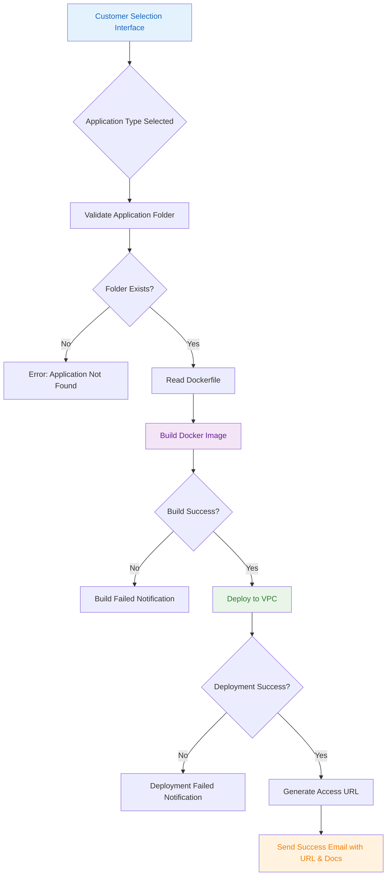
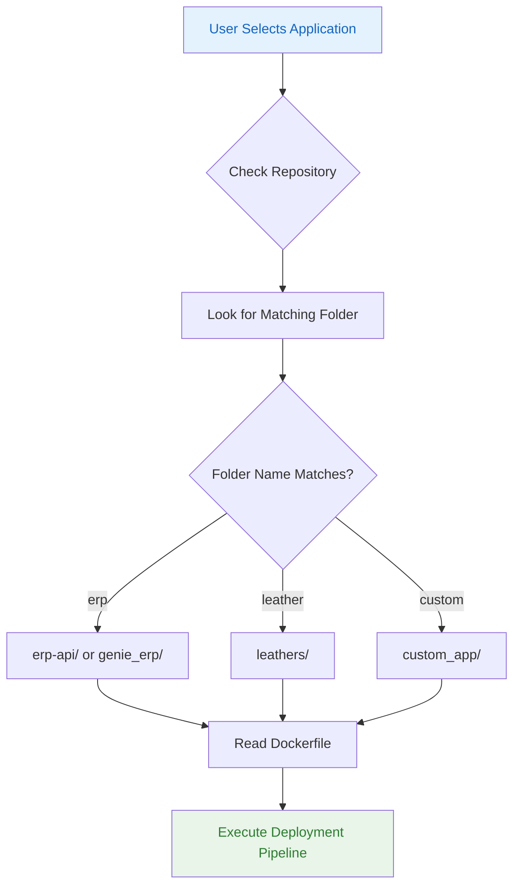
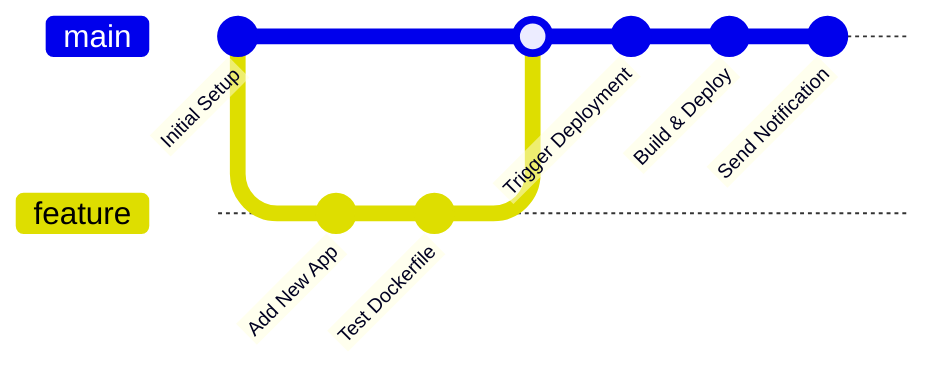

# SaaS Deployment Platform

A fully automated deployment platform that allows customers to deploy various applications (React, Angular, APIs, etc.) with a simple selection interface. The platform handles containerization, deployment to VPC, and customer notifications automatically.

## 🚀 Features

- **Multi-Application Support**: Deploy React, Angular, Node.js APIs, and other web applications
- **Automated Pipeline**: Complete CI/CD pipeline from application selection to deployment
- **VPC Deployment**: Secure deployment in configured Virtual Private Cloud
- **Email Notifications**: Automatic success notifications with deployment URLs and documentation
- **Docker Containerization**: Automatic Docker image building and deployment
- **Customer Management**: Track deployments by customer name and email

## 🏗️ Architecture Overview



## 📁 Repository Structure

```
saas-deployment-platform/
├── .github/
│   └── workflows/
│       └── deploy.yml 
|       └── cleanup.yml
|       └── main.yml 
|       └── send_email.yml   # Main deployment pipeline
├── Documentation/              # Platform documentation
├── erp-api/                   # ERP API application
│   ├── Dockerfile
│   ├── src/
├── genie_erp/                 # Genie ERP application
│   ├── Dockerfile
│   ├── build/
├── leathers/                  # Leather management app
│   ├── Dockerfile
│   ├── dist/
├── Scripts/                   # Deployment scripts
│   ├── deploy.sh
│   └── 
├── .gitignore
├── LICENSE
└── README.md
```

## 🔧 How It Works

### Application Matching Logic



## 📦 Adding New Applications

### Step 1: Create Application Folder

Create a new folder in the repository root with your application name:

```bash
mkdir your-app-name
cd your-app-name
```

### Step 2: Add Your Application Files

Copy your built application files to the folder:

```
your-app-name/
├── Dockerfile              # Required
├── build/                  # For React apps
├── dist/                   # For Angular apps  
├── src/                    # For API applications
├── package.json           # If Node.js based
└── requirements.txt       # If Python based
```

### Step 3: Create Dockerfile

Create an appropriate Dockerfile based on your application type:

#### React Application
```dockerfile
FROM nginx:alpine
COPY build/ /usr/share/nginx/html/
EXPOSE 80
CMD ["nginx", "-g", "daemon off;"]
```

#### Angular Application
```dockerfile
FROM nginx:alpine
RUN rm -rf /usr/share/nginx/html/*
COPY browser/ /usr/share/nginx/html/
EXPOSE 80
CMD ["nginx", "-g", "daemon off;"]

#### Node.js API
```dockerfile
FROM node:16-alpine
WORKDIR /app
COPY package*.json ./
RUN npm install --production
COPY src/ ./src/
EXPOSE 3000
CMD ["npm", "start"]
```

#### Php API
```dockerfile
FROM mcr.microsoft.com/dotnet/aspnet:8.0 AS runtime
WORKDIR /app
COPY . .
EXPOSE 80
EXPOSE 443
ENTRYPOINT ["dotnet", "GENIE_ERP.dll"]


#### Python API
```dockerfile
FROM python:3.9-slim
WORKDIR /app
COPY requirements.txt .
RUN pip install -r requirements.txt
COPY . .
EXPOSE 8000
CMD ["python", "app.py"]
```

### Step 4: Update Pipeline Configuration

Add your application to the deployment pipeline by updating `.github/workflows/deploy.yml`:

```yaml
# Add your application name to the validation list
- name: Validate Application
  run: |
    case "${{ github.event.inputs.application }}" in
      "erp"|"genie_erp"|"leathers"|"your-app-name")
        echo "Valid application selected"
        ;;
      *)
        echo "Invalid application name"
        exit 1
        ;;
    esac
```

### Step 5: Test Your Application

1. **Local Testing**: Test your Dockerfile locally:
   ```bash
   docker build -t your-app-name .
   docker run -p 8080:80 your-app-name
   ```

2. **Commit and Push**:
   ```bash
   git add your-app-name/
   git commit -m "Add new application: your-app-name"
   git push origin main
   ```

## 🔄 Deployment Process

### Manual Trigger

1. Go to GitHub Actions tab
2. Select "Deploy Application" workflow
3. Click "Run workflow"
4. Fill in the required parameters:
   - **Customer Name**: Client's full name
   - **Customer Email**: Valid email address
   - **Application**: Select from available applications

### Automated Process



## 📧 Email Notification Format

Upon successful deployment, customers receive:

- **Subject**: "Purchase Confirmation for Customer:{{Customer_name}}"
- **Content**:
   Dear Customer,

 🎉 Congratulations! Your SaaS application has been successfully deployed and is now ready for use.

 🔗 You can access your instance using the link below:
 👉 http://deployurl.com

  If you have any questions or need assistance, feel free to reach out to our support team.
  Best regards, 
  **ERP Deployment Team**

## 🛠️ Environment Configuration

### Required Environment Variables

```yaml
# GitHub Secrets
VPC_HOST: "your-host"
VPS_USER: "your-user"
VPS_PASSWORD: "your-password"
```

## 🚨 Troubleshooting

### Common Issues

| Issue | Solution |
|-------|----------|
| Application folder not found | Ensure folder name matches exactly what user selected |
| Docker build fails | Check Dockerfile syntax and file paths |
| Deployment timeout | Increase timeout in pipeline configuration |
| Email not received | Verify SMTP configuration and customer email |

### Debug Commands

```bash
# Check Docker image
docker images | grep your-app-name

# View container logs  
docker logs container-id

# Test email configuration
python Scripts/test-email.py
```

## 📋 Application Checklist

Before adding a new application, ensure:

- [ ] Application builds successfully locally
- [ ] Dockerfile is optimized and secure
- [ ] All dependencies are included
- [ ] Port configuration is correct
- [ ] **API Documentation created** (For API applications - must match folder name)
- [ ] **Documentation placed in Documentation/ folder**
- [ ] Health check endpoint available (recommended)
- [ ] Documentation updated
- [ ] Pipeline configuration updated

### API Application Requirements:
- [ ] Create `{folder_name}.docx` in `Documentation/` folder
- [ ] Document all API endpoints with URLs (e.g., `api/test.php`)
- [ ] Include HTTP methods and purpose for each endpoint
- [ ] Specify required parameters and response formats

## 📞 Support

For deployment issues or questions:
- Create an issue in this repository
- Email: tarunkrish2001@gmailcom

**Note**: This platform is designed for development and staging environments. For production deployments, additional security measures and monitoring should be implemented.
